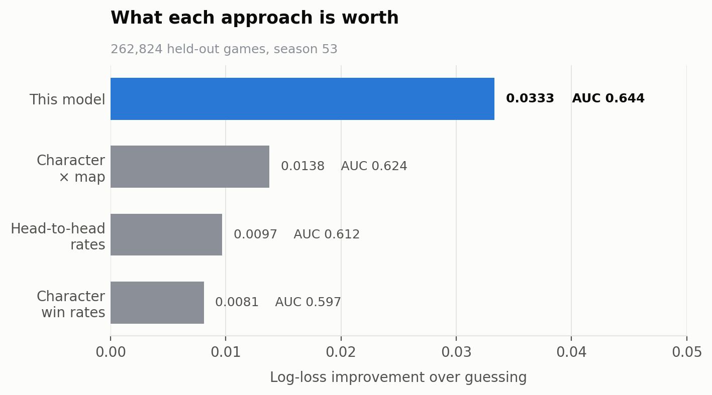
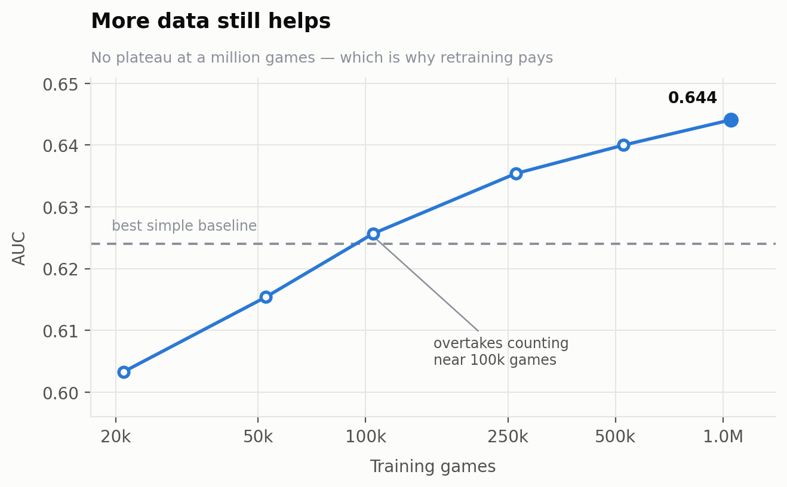

# Brawl Stars Draft Agent

Estimates which side a ranked draft favours, and recommends what to pick next.
Trained on 1.3 million games.

[](https://github.com/elixf7/brawlstars-draft-agent/actions/workflows/ci.yml)
[](https://github.com/elixf7/brawlstars-draft-agent/actions/workflows/train.yml)
[](https://www.python.org/)
[](LICENSE)

**[Try the draft assistant →](https://elixf7.github.io/brawlstars-draft-agent/)** ·
**[Dataset →](https://huggingface.co/datasets/EliF77/brawlstars-ranked)** ·
**[Data pipeline →](https://github.com/elixf7/brawlstars-data-pipeline)**

---

## What it does

Six characters get picked before a ranked match starts, in a snake order, on a
known map. Some pairs work together, some counter each other, and what is strong
depends on the map and the skill of the lobby. This estimates the win
probability of a completed draft, and uses that to rank what to pick next.

The dashboard runs the model in your browser. Fill in either side and the
probability moves as you pick, with the strongest remaining options listed
beneath — and an adjustable amount of lookahead, which changes the answer.

## What it achieves

Every predictor below is scored on the same 262,824 games, held out **by date**,
so the model is judged on matches played after everything it learned from.



| Predictor | What it uses | Log-loss | AUC | Calibration error |
| --- | --- | ---: | ---: | ---: |
| Constant | Nothing | 0.6931 | 0.500 | 0.001 |
| Character win rates | Which characters win | 0.6850 | 0.597 | 0.046 |
| Character × map | …and where | 0.6794 | 0.624 | 0.057 |
| Head-to-head rates | Which beat which | 0.6834 | 0.612 | 0.056 |
| **This model** | All of it, jointly | **0.6598** | **0.644** | **0.005** |

Log-loss penalises confident mistakes; 0.6931 is the score for predicting 50%
every time. The comparison is the result rather than the absolute number —
counting character-and-map win rates already reaches 0.6794, so a model near
that figure would add nothing over a lookup table. This one captures **more than
twice** the signal of the best count-based alternative.

Calibration matters as much as ranking, because the recommender combines these
probabilities across simulated drafts. An evaluator that is confidently wrong
compounds its error; one that is honestly uncertain does not. The count-based
methods rank respectably and are badly overconfident.

**A note on the ceiling.** Matches are decided by execution as much as by
composition, and the better draft loses routinely. An AUC of 0.64 is a real edge
on a genuinely noisy target, not a strong classifier.

## How it works

### The win-probability model

A field-aware factorization machine. Rather than one weight per character it
learns several short vectors for each — one for playing *beside* a teammate, one
for playing *against* an opponent, one for suiting the map and skill context.
Interactions are the model: removing them drops AUC from 0.644 to 0.581.

The score is a **difference between the two teams**, which makes
`P(A beats B) + P(B beats A) = 1` exact by construction rather than something
learned approximately. Tree search depends on that identity, since it flips the
evaluator to model the opponent.

Counters use separate attack and defend vectors, because an inner product is
symmetric and a single vector per character would say the same thing about "A
beats B" as about "B beats A".

It is small — 29,354 parameters — which is why the dashboard can ship the whole
model to the browser and run inference client-side.

### Searching the draft

A pick is not good or bad on its own; it depends on the reply. Monte Carlo tree
search plays the remaining picks forward against a modelled opponent, so a
character that scores well alone but is easily answered gets discounted.

The dashboard does a lighter version of this — each of the strongest candidates
is played out to a full six-pick draft, repeatedly — and the difference is
visible: with lookahead off the top recommendation changes.

### Learning to search less

Self-play distils the search into a policy network that proposes strong picks
directly, so a recommendation does not require a live tree search.

This is distillation rather than reinforcement learning: the training signal is
the win-probability model's own judgement of the finished draft, not a match
outcome. It learns to reach the same answers faster, and cannot exceed what the
evaluator knows. Promotion of a new policy is decided by a *second* evaluator
trained on a different half of the season, so the policy is not judged by the
thing it was optimised against.

### What the model learned about roles

Projecting each character's learned interaction vectors puts El Primo beside
Darryl, Bull and Bibi; Piper beside Angelo, Squeak and Nani; Mortis beside Alli,
Lily and Kenji.

Nothing told the model what a tank or a sniper is. It only ever saw which drafts
won. The [character map](https://elixf7.github.io/brawlstars-draft-agent/) on the
dashboard is that projection, coloured by strength in whatever context you
select.

## The data

A companion project,
[brawlstars-data-pipeline](https://github.com/elixf7/brawlstars-data-pipeline),
crawls the game's API on a schedule and publishes ranked matches as a versioned
dataset. Training reads it **pinned to an exact commit**:

```python
from bsdraft.data.sources import resolve_dataset
ref = resolve_dataset("season53")   # EliF77/brawlstars-ranked@4c45efee:season53
```

That matters because the dataset grows every time the pipeline runs. "Trained on
the dataset" is not reproducible; "trained on commit `4c45efee`" is.



There is no plateau at a million games, which is why the model is retrained
weekly. It also sets a floor: below roughly 100,000 games the model scores worse
than counting, so an early-season model is checked against the baselines before
it replaces anything.

## Running it

Requires Python 3.13 and [uv](https://docs.astral.sh/uv/).

```bash
uv sync
uv run bsdraft-train fm   -c configs/season53.toml   # ~20 seconds
uv run bsdraft-eval       -c configs/season53.toml   # the table above
uv run bsdraft-dashboard  -c configs/season53.toml   # rebuild the page
```

A run is described by a config file rather than remembered arguments:

```toml
name = "season53"
seed = 20260903

[data]
season  = "season53"
elo_min = 10.0

[fm]
model = "ffm"
k     = 64
lr    = 1e-3
```

Runs are **bit-for-bit reproducible** — the same config and seed produce
identical weights. Seeding alone does not achieve that, since floating-point
reduction order stays free, so deterministic algorithms are enabled as well.

### Tracking experiments

Every run records its configuration, metrics, git commit, dataset revision, and
the artifacts it produced with their content hashes.

```bash
uv run bsdraft-runs list                       # recent runs and their metrics
uv run bsdraft-runs best --metric val_logloss  # the winner, and where its model is
uv run bsdraft-runs compare <run-a> <run-b>
```

`compare` diffs the configurations too, so *why* two runs differ sits beside
*how* they differ:

```
metric          181322-b0d7bf   181318-f1c952   181314-755698
val_auc                0.5032          0.5381          0.4821
val_logloss            0.6930          0.6929          0.6932

config differences
  fm.k                       64              32               8
```

### Retraining

[`.github/workflows/train.yml`](.github/workflows/train.yml) runs weekly, after
the pipeline's collection.

```
retrain  ──▶  gate  ──▶  self-play  ──▶  dashboard  ──▶  published
 20 sec      must beat   weeks 2 & 4      rebuilt        to Pages
             baselines   of the season
```

The cadence is asymmetric because the stages behave differently. The model keeps
improving as data accumulates and trains in seconds, so it runs weekly.
Self-play plateaus after one iteration, so it runs twice a season instead.

Nothing publishes unless it earns it: the gate requires beating every baseline
on at least 100,000 training and 10,000 held-out games.

## Layout

```
src/bsdraft/
  data/       loading matches, the head-to-head database
  features/   turning drafts into model inputs
  fm/         the win-probability model
  mcts/       draft state, tree search, recommendation
  selfplay/   self-play and the networks trained on it
  eval/       baselines, metrics, the independent judge
  dashboard/  the static page and its payload
configs/      run definitions
tests/        151 tests, no network required
```

Tests run against a committed sample of 4,000 real games, so feature
construction and the split are exercised on realistic data.

## Documentation

| | |
| --- | --- |
| [`docs/MODEL.md`](docs/MODEL.md) | The model, and what the numbers mean |
| [`docs/MODEL_CARD.md`](docs/MODEL_CARD.md) | Intended use, performance, limitations |
| [`docs/DATA.md`](docs/DATA.md) | Where the data comes from and what a row is |

## Limitations

- **No pick order or bans.** The API returns the six final characters with no
  record of who picked when. The model sees compositions, not sequences.
- **Self-play is bounded by the evaluator**, since that is what supplies its
  training signal.
- **The sample is not uniform** — crawling outward from seed players within an
  elo band over-represents active and higher-rated players.
- **One season per model.** Balance changes move what is strong, so seasons are
  not pooled.

## License

MIT — see [LICENSE](LICENSE). Not affiliated with or endorsed by Supercell; fan
content made under Supercell's
[Fan Content Policy](https://supercell.com/en/fan-content-policy/).
